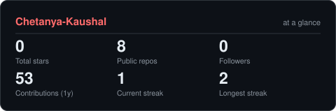

<!-- PORTRAIT - generated by scripts/dotify.py from assets/me.jpg. Regenerate with:
       python scripts/dotify.py assets/me.jpg -o assets/portrait \
         --cols 88 --equalize --detail 0.5 --color --square -->

 

<!-- NAME / TAGLINE - animated typing -->

 

<!-- SOCIALS -->

---

## `( whoami )`

Hi, I'm **Chetanya Kaushal** — an Oracle HCM Cloud Techno-Functional Consultant and AI Agent
Architect who works where enterprise technology meets intelligent automation. Deep in Oracle
Fusion HCM Cloud — Core HR, Payroll, Absence, Talent, HRSD — with OIC, Fast Formulas and OTBI
on the side.

- Currently building **autonomous AI agents for Oracle HCM** — payroll processing, HR document
  intelligence, and compliance monitoring
- Portfolio: **[chetanyakaushal.com](https://chetanyakaushal.com)**
- Learning **LangChain, RAG and agent frameworks**
- Fun fact: it started in 2023, discovering what intelligent automation could do inside HR
  systems

 

## `( toolbox )`

---

## `( skill radar )`

<table>
<tr>
<td width="50%" align="center" valign="middle">

<!-- Self-rated radar - edit assets/skills.json, the workflow redraws it -->
<picture>
  <source media="(prefers-color-scheme: dark)"  srcset="assets/radar-dark.svg">
  <source media="(prefers-color-scheme: light)" srcset="assets/radar-light.svg">
  
</picture>

</td>
<td width="50%" align="center" valign="middle">

<!-- Live radar built from real language byte counts across your repos -->
<picture>
  <source media="(prefers-color-scheme: dark)"  srcset="assets/radar-langs-dark.svg">
  <source media="(prefers-color-scheme: light)" srcset="assets/radar-langs-light.svg">
  
</picture>

</td>
</tr>
</table>

---

## `( contribution calendar )`

<!-- 3D isometric calendar, regenerated every 6h by .github/workflows/metrics.yml -->

  

<!-- Snake eats the contribution graph - .github/workflows/snake.yml -->
<picture>
  <source media="(prefers-color-scheme: dark)"  srcset="https://raw.githubusercontent.com/Chetanya-Kaushal/Chetanya-Kaushal/output/snake-dark.svg">
  <source media="(prefers-color-scheme: light)" srcset="https://raw.githubusercontent.com/Chetanya-Kaushal/Chetanya-Kaushal/output/snake.svg">
  
</picture>

---

## `( the numbers )`

<!-- Generated by scripts/cards.py into this repo. Deliberately NOT
     github-readme-stats / streak-stats / github-profile-trophy: those are
     shared public instances that go down and take the whole section with them. -->
<picture>
  <source media="(prefers-color-scheme: dark)"  srcset="assets/card-stats-dark.svg">
  <source media="(prefers-color-scheme: light)" srcset="assets/card-stats-light.svg">
  
</picture>

 

  

---

## `( selected work )`

<!-- Hand-written cards of what's showcased on chetanyakaushal.com. These
     products aren't public repos, so they're static instead of the live API
     cards scripts/cards.py draws from assets/projects.json. -->

<table>
<tr>
<td width="50%">
  <h3>HDL Workbench</h3>
  <b>AI-Powered Data Loading</b>
    
  Intelligent workbench for Oracle HCM Data Loader with AI-assisted mapping, validation, and error resolution.
    
  `React` `Python` `Oracle HDL` `GPT-4`
</td>
<td width="50%">
  <h3>Payroll AI Agent</h3>
  <b>Autonomous Payroll Processing</b>
    
  Self-operating AI agent that handles payroll calculations, anomaly detection, and compliance verification.
    
  `LangChain` `FastAPI` `Oracle Payroll` `RAG`
</td>
</tr>
<tr>
<td width="50%">
  <h3>HR Document Intelligence</h3>
  <b>Smart Document Processing</b>
    
  AI system that classifies, extracts, and processes HR documents with human-level accuracy.
    
  `OCR` `NLP` `Python` `Oracle HCM`
</td>
<td width="50%">
  <h3>Employee Portal</h3>
  <b>Self-Service HR Platform</b>
    
  Modern employee self-service portal with an AI chatbot for HR queries, leave management, and benefits.
    
  `React` `Oracle HCM` `REST API` `AI Chat`
</td>
</tr>
<tr>
<td width="50%">
  <h3>Compliance Monitor</h3>
  <b>Automated Compliance Checking</b>
    
  Real-time monitoring and automated compliance verification across Oracle HCM configurations.
    
  `Python` `Oracle Cloud` `Analytics` `Rules Engine`
</td>
<td width="50%" align="center">
    
  <i>The agents and tools above run in production — details on
  <a href="https://chetanyakaushal.com">chetanyakaushal.com</a>.</i>
</td>
</tr>
</table>

---

Oracle HCM Cloud · AI Agent Architecture · Autonomous HR Automation

